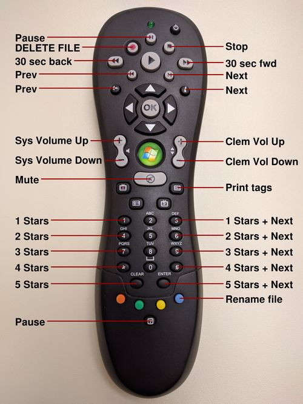
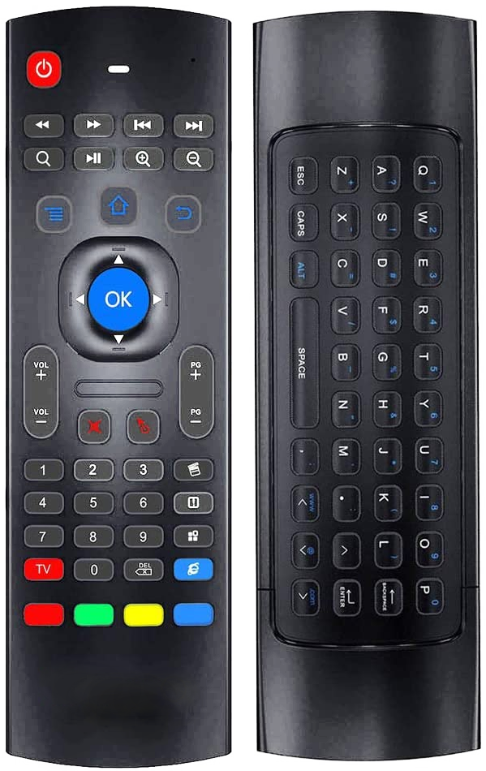

# Clemote - Remote Control for Clementine Player



This app reads button presses from a remote control, sends commands to the Clementine Player, deletes and renames files, and updates song ratings.

Any device that shows up as an input device in Linux is supported. This includes almost all Bluetooth, USB, and wireless (via IR, USB dongle, etc) remotes.

The app controls Clementine via D-Bus. File and tag operations are performed directly, after which the Clementine library is synchronized in order to make the changes visible in the tracklists.

### Usage

- Start the Clementine Player
- Start this app with:

```shell
$ clemote remote </dev/input/eventX>
```

Where `/dev/input/eventX` is the receiver for your remote control.

You may have to run the app as root and the device number may change when you plug or unplug devices, or reboot the computer. To fix these issue, see below.

If you need instructions for how to run the app automatically as a service, feel free to add a ticket.

**Warning: The RECORD button immediately deletes the currently playing file from disk.**

The blue button adds ".delete" to the filename of the currently playing file but does not delete the file.

### Finding your remote control receiver device

```shell
$ cat /proc/bus/input/devices
```

Look for a device such as

```shell
I: Bus=0003 Vendor=1019 Product=0f38 Version=0000
N: Name="Media Center Ed. eHome Infrared Remote Transceiver (1019:0f38)"
P: Phys=usb-0000:29:00.3-4
S: Sysfs=/devices/pci0000:00/0000:00:07.1/0000:29:00.3/usb5/5-4/5-4:1.0/rc/rc0/input36
U: Uniq=
H: Handlers=kbd event19 
B: PROP=20
B: EV=100017
B: KEY=fff 0 4200108fc32e 237605100000000 0 700158000 419200004001 8e968000000000 10000000
B: REL=3
B: MSC=10
```

You now have the device (`/dev/input/event15` in this case).

### Creating a persistent device and allow use by regular user

The device number may change when you plug or unplug devices, or reboot the computer. It may also be usable only by root. To fix these issues, add a udev file:

```shell
$ sudo editor /etc/udev/rules.d/10-clemote.rules
```

With contents:

```shell
ACTION=="add", ATTRS{idVendor}=="1019", ATTRS{idProduct}=="0f38", SYMLINK+="remote_control", MODE="0777"
```

Replace the `1019` and `0f38` values in this example with the values you found in the `vendor` and `product` sections of the output from `lsinput`. The values must be 4 digits in udev, so add `0`s if necessary. Remove `0x`. E.g.: `0xf38` -> `0f38`.

To activate the new rule, unplug and plug the remote control receiver or reboot the computer.

You should now be able to start the app as a regular user with:

```shell
$ clemote remote /dev/remote_control
```

### Setup

- Allow the app to trigger refresh in Clementine to show changes:


    Clementine > Tools > Preferences > Music Library
        > Monitor library for changes > Enable

### Build on Linux

Tested on Linux Mint 20. Should also work on Ubuntu and other distributions based on Debian.

Packaged dependencies:

```shell
$ sudo apt install \
build-essential ninja-build cmake clang-format \
libboost-filesystem-dev libboost-system-dev \
libsystemd-dev libpulse-dev libevdev-dev \
libtag1-dev libfmt-dev libasound-dev
```

sdbus-cpp:

```shell
$ cd clemote
$ mkdir -p libraries
$ git clone https://github.com/Kistler-Group/sdbus-cpp.git libraries/sdbus-cpp
$ cd libraries/sdbus-cpp
```

- Follow the instructions in `INSTALL`.

Get the source and build:

```shell
$ bash -c '
  git clone git@github.com:rogerdahl/clemote.git
  cd clemote
  mkdir -p build && cd build
  cmake -DCMAKE_BUILD_TYPE=Release -G Ninja ..
  ninja
'
```

### Troubleshooting

- This app does not need LIRC, and LIRC may interfere if installed. Try:

```shell
$ sudo apt remove lirc
```

- Use `d-feet` to troubleshoot D-Bus issues:

```shell
$ sudo apt install d-feet
$ d-feet
```

- Missing library, e.g.,

```
./clemote: error while loading shared libraries:
  libsdbus-c++.so.0: cannot open shared object file: No such file or directory
```

Update the library cache:

```bash
$ sudo ldconfig
```

- Input devices that register as multiple devices

Some input devices register multiple devices. E.g., this remote control, which has a built-in keyboard and air mouse.



```shell
/dev/input/event23
   bustype : BUS_USB
   vendor  : 0x1915
   product : 0x1028
   version : 257
   name    : "123 COM Smart Control"
   phys    : "usb-0000:00:14.0-6.4/input0"
   uniq    : ""
   bits ev : (null) (null) (null) (null) (null)

/dev/input/event24
   bustype : BUS_USB
   vendor  : 0x1915
   product : 0x1028
   version : 257
   name    : "123 COM Smart Control Mouse"
   phys    : "usb-0000:00:14.0-6.4/input1"
   uniq    : ""
   bits ev : (null) (null) (null) (null)

/dev/input/event25
   bustype : BUS_USB
   vendor  : 0x1915
   product : 0x1028
   version : 257
   name    : "123 COM Smart Control Consumer C"
   phys    : "usb-0000:00:14.0-6.4/input1"
   uniq    : ""
   bits ev : (null) (null) (null) (null) (null)

/dev/input/event26
   bustype : BUS_USB
   vendor  : 0x1915
   product : 0x1028
   version : 257
   name    : "123 COM Smart Control System Con"
   phys    : "usb-0000:00:14.0-6.4/input1"
   uniq    : ""
   bits ev : (null) (null) (null)
```

Currently, Clemote can handle input from only one device. If the desired buttons are spread across two or more devices, you can start multiple versions of Clemote, and pointing each to a separate device.

To find the device to use in clemote, use the `lsinput` and `input-events` commands.

### Technologies

- sdbus-cpp - High level D-Bus C++ bindings
- taglib - Battle tested audio metadata library
